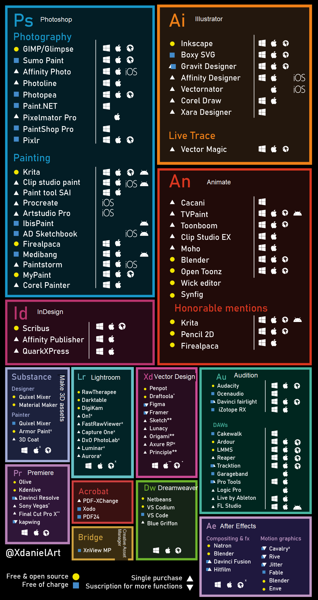

# Useful resources - thanks to you!

## CSS
- [Flexbox guide](https://css-tricks.com/snippets/css/a-guide-to-flexbox/)
- [More Flex](https://flexbox.malven.co/)
- [Grid](https://grid.malven.co/)
- [Bootstrap Cheat Sheet](https://bootstrap-cheatsheet.themeselection.com/)
- [Bootstrap itself](https://getbootstrap.com/docs/5.2/getting-started/introduction/)
- [Material UI Toggle Switch](https://mui.com/material-ui/react-switch/)
- [CSS Resets](https://perishablepress.com/a-killer-collection-of-global-css-reset-styles/) 
- [Drag & Drop React File Upload](https://www.bezkoder.com/drag-drop-file-upload-react-hooks/)
- [Tailwind CSS](https://tailwindcss.com)
- [Transparent Textures](https://www.transparenttextures.com/)
- [CSS Animations](https://animate.style/)
- [CSS Gradients](https://cssgradient.io)
- [Color Palettes](https://colorhunt.co/)
- [Material UI Dashboards - React](https://www.creative-tim.com/product/material-dashboard-react?AFFILIATE=128200)
- [UI Gradients](https://uigradients.com/)
- [LESS demo by Melissa](https://hackmd.io/fGzQTZXjQMOJRjW6k14Zvw?view)

## Flask
- [Flask Extensions/Libraries](https://www.fullstackpython.com/flask-extensions-plug-ins-related-libraries.html)

## Git
- [Melissa’s git website/notes](https://codingdojo-onl-pt-versioncontrol.github.io/terminalGit/index)
- [Git cheatsheet](https://www.atlassian.com/git/tutorials/atlassian-git-cheatsheet)

## Generators
- [Lorem Ipsum Generator](https://beedev-themes.github.io/lorem-ipsum/index.html#navy)
- [Gitignore Generator](https://www.toptal.com/developers/gitignore)
- [gitignore file generator](https://gitignore.io)
- [Github Readme Generator](https://arturssmirnovs.github.io/github-profile-readme-generator/)
- [Another Github Readme](https://github.com/abhisheknaiidu/awesome-github-profile-readme/blob/master/README.md)

## General
- [RegEx](https://regex101.com/)
- [w3schools](https://www.w3schools.com/)
- [strftime cheatsheet](https://strftime.org/) 
- [Python tutorials](https://www.py4e.com/)
- [Django tutorials](https://www.dj4e.com/)
- [Visual of SQL joins](https://blog.codinghorror.com/a-visual-explanation-of-sql-joins/)
- [File converter](https://cloudconvert.com/)
- [JS console tricks](https://javascript.plainenglish.io/why-using-just-console-log-in-2023-is-a-big-no-no-ef99f1940901)
- Alternatives to Adobe products (courtesy of https://twitter.com/XdanielArt/status/1434611199140896772):

## Images
- [Free static images](https://unsplash.com/)
- [Images Placeholder](https://placeholder.com)
- [Free Icons](https://freeicons.io/)
- [Google Fonts](https://fonts.google.com/)

## Videos
- [Imposter Syndrome](https://www.youtube.com/watch?v=6TYkDy54q4E)
- [Balsamiq wireframes tutorial](https://www.youtube.com/watch?v=9Pv002d0Kls&list=PLVlyYfbClWxQDCGC-A1FkbGyIxtuIN5IM)
- [Lots of technology short videos](https://www.youtube.com/@Fireship)
- [Being a responsible developer](https://www.youtube.com/watch?v=7EmboKQH8lM)
- [Login/reg with MERN](https://www.youtube.com/watch?v=ZCJLrFw33Q0)
- [Kevin Powell](https://www.youtube.com/kepowob)

## Documentation
- [Jinja with Flask](https://flask.palletsprojects.com/en/2.2.x/templating/)
- [Django Docs](https://docs.djangoproject.com/en/4.1/)
- [More Django with REST API](https://www.django-rest-framework.org/)
- [MongoDB](https://www.mongodb.com/docs/manual/)
- [Express](https://expressjs.com/en/starter/installing.html)
- [React](https://reactjs.org/docs/getting-started.html)
- [Python strptime](https://docs.python.org/3.6/library/time.html#time.strptime)
- [w3 schools](https://www.w3schools.com/)
- [MDN Docs](https://developer.mozilla.org/en-US/)
- [Python](https://docs.python.org/3/)
- [Python](https://docs.python.org/3/library/index.html)
- [Java](https://www.oracle.com/java/technologies/)
- [Jinja](https://jinja.palletsprojects.com/en/3.1.x/)
- [React](https://reactjs.org/)
- [NPM](https://www.npmjs.com/)
- [Validator](https://validator.w3.org/)

## Project Boards
- [Trello](https://trello.com/)
- [Asana](https://app.asana.com/)
- [Clickup](https://clickup.com/)
- [Jira](https://www.atlassian.com/software/jira)

## IDE's / Scripting Tools
- [Exercism](https://exercism.org/)
- [FreeCodeCamp](https://www.freecodecamp.org)
- [Programiz](https://www.programiz.com/)
- [Inkdrop - Markdown](https://www.inkdrop.app/)
- [Emmet Cheat Sheet](https://docs.emmet.io/cheat-sheet/)
- [Keyboard Shortcuts - VS Code](https://usethekeyboard.com/vs-code/)
- [Python Tutor - used for Java, JS, Python](https://pythontutor.com/javascript.html#mode=edit)
- [Replit](https://replit.com/)
- [CodeSandbox - React & HTML](https://codesandbox.io/)
- [CodePen - HTML](https://codepen.io/your-work)
- [GoormIDE - React, Python, Java & MORE](https://ide.goorm.io/)
- [Glitch - Frontend/ Node](https://glitch.com/)
- [HTML Editor](https://html-online.com/editor/)
- [JSFiddle](https://jsfiddle.net/)
- [JS Bin](https://jsbin.com/?html,output)

## Cheatsheets
- [TailwindCSS Cheatsheet](https://nerdcave.com/tailwind-cheat-sheet)
- [BootStrap CheatSheets](https://bootstrap-cheatsheet.themeselection.com)
- [Codecademy CheatSheets](https://www.codecademy.com/resources/cheatsheets/all)
- [CSS Cheatsheet](https://web.dev/learn/css/)
- [VS Code Shortcuts](https://code.visualstudio.com/shortcuts/keyboard-shortcuts-windows.pdf)
- [html/css/js](https://htmlcheatsheet.com/css/)
- [Vim Cheatsheet](https://vim.rtorr.com/)
- [Discord Markdown](https://support.discord.com/hc/en-us/articles/210298617-Markdown-Text-101-Chat-Formatting-Bold-Italic-Underline-)
- [Markdown](https://www.tablesgenerator.com/markdown_tables)
- [SQL Cheat Sheet](https://learnsql.com/blog/sql-basics-cheat-sheet/)
- [MongoDB CheatSheet](https://www.mongodb.com/developer/products/mongodb/cheat-sheet/)

## Other demos by Melissa
- [Dynamically rendering images](https://github.com/melissa-24/favoriteImages/blob/main/htmlOnly/js/tunes.js)
- [Using an API to render an image dynamically](https://github.com/melissa-24/favoriteImages/blob/main/htmlOnly/js/nasa.js)

Thank you everybody for helping create this resource sheet!  You are all awesome!!!